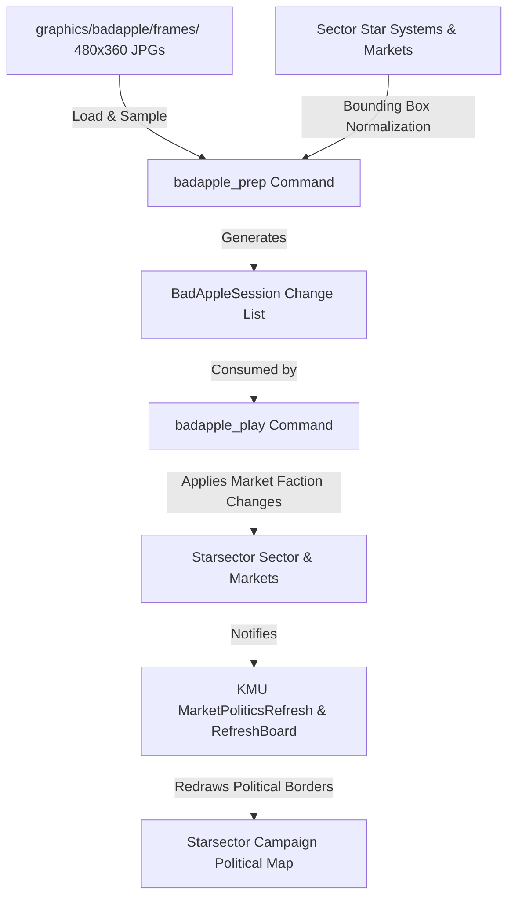

# Requirements

### Overview & Goals
The goal is to render the Bad Apple video on Starsector's campaign map using political spheres of influence generated by Klark Morrigan's Utilities (KMU). The solution uses existing star systems and factions (Hegemony vs Sindrian Diktat), precalculating market faction flips from video frames and playing them back at a controlled, parameterized pace for clean footage recording.

### Scope
- **In Scope**:
  - Scanning existing star systems in hyperspace and normalizing their positions to match frame dimensions.
  - Preprocessing frame images (`graphics/badapple/frames/output_*.jpg`) into sequential lists of market faction changes.
  - Using **Sindrian Diktat** (`sindrian_diktat`) and **Hegemony** (`hegemony`) as visual high-contrast factions.
  - Providing 2 Console Commands via `Console Commands`: one for preprocessing (`badapple_prep`), one for playback (`badapple_play`).
  - Configurable playback interval/delay for controlled footage recording.
  - Procedural code organization with long, step-commented functions and minimal class proliferation.
  - Triggering KMU map refresh on market state changes.
- **Out of Scope**:
  - Grid-based artificial star spawning (using natural or high-density sector systems instead).
  - Audio synchronization or custom music player (audio and timing sync will be handled during video editing in Blender).
  - Custom dummy factions.

### User Stories
- **As a video creator**, I want to run a preprocessing console command that analyzes star positions against Bad Apple frames so that per-frame market updates are prepared upfront.
- **As a video creator**, I want to run a playback console command with a configurable delay parameter so that the map updates at a steady, capturable pace for screen recording.
- **As a player/modder**, I want clear procedural code with descriptive comment blocks so that the workflow is straightforward to follow and maintain without OOP overengineering.

### Functional Requirements
1. **System Position Mapping**: Calculate bounding box across all active star systems with markets, mapping hyperspace coordinates $(X, Y)$ into frame pixel coordinates $(P_x, P_y)$.
2. **Sequential Frame Sampling**: Read frames `output_0001.jpg` to `output_6572.jpg`, sample pixel brightness at mapped system coordinates, and record faction transitions (`sindrian_diktat` vs `hegemony`).
3. **Delta Change Storage**: Store only systems whose state changes between consecutive frames to ensure lightweight per-frame updates.
4. **Console Commands Interface**:
   - `badapple_prep [maxFrames] [brightnessThreshold]`
   - `badapple_play [frameDelaySeconds] [startFrame]` / `badapple_stop`
5. **KMU Refresh Trigger**: Notify KMU's `MarketPoliticsRefresh` and refresh board when factions change to trigger political border recalculation.

### Non-Functional Requirements
- **Performance**: Preprocessing should complete within a few seconds; playback step should execute instantaneously per tick without UI lag.
- **Code Style**: Procedural design with long, readable methods organized by commented stages, using simple data containers where necessary.


# Technical Design

### Current Implementation & Assets
- **Frames**: 6,572 JPEG frames ($480 \times 360$) located in `graphics/badapple/frames/output_XXXX.jpg`.
- **Dependencies**: Starsector API, `Console Commands` (`org.lazywizard.console.BaseCommand`), `KMU` (`kmu.maplayers.politicalmap.base.refresh.MarketPoliticsRefresh`, `kmu.maplayers.base.refresh.MapLayerRefreshBoard`).
- **Mod Base**: `santomon.BadApple.BadAppleModPlugin`.

### Key Decisions
1. **Procedural Architecture**: Keep preprocessing and playback execution in dedicated command scripts with structured step blocks (Comments: `// --- 1. System Discovery ---`, `// --- 2. Frame Sampling ---`, etc.) rather than deep OOP abstractions.
2. **Vanilla Factions**: Use `hegemony` (gold/yellow) and `sindrian_diktat` (purple/blue) for distinct border contrast on the political map overlay.
3. **Hyperspace Coordinate Bounding Box**: Compute min/max coordinates of existing systems to fill the aspect ratio of the $480 \times 360$ frames.
4. **Direct Market Faction Assignment & KMU Event Signaling**: Call `market.setFactionId(...)` and `MarketPoliticsRefresh.reportMarketChange(...)` per flipped market during playback.

### Architecture Diagram


### Components & File Structure
- `data/console/commands.csv`: Registers `badapple_prep` and `badapple_play`.
- `src/santomon/BadApple/data/BadAppleData.java`: Plain data holder structs (`BadAppleMarketChange`, `BadAppleFrameData`, `BadAppleSession`).
- `src/santomon/BadApple/commands/BadApplePreprocessCommand.java`: Implements `BaseCommand` for frame analysis and change extraction.
- `src/santomon/BadApple/commands/BadApplePlayCommand.java`: Implements `BaseCommand` to launch and control playback.
- `src/santomon/BadApple/playback/BadApplePlaybackScript.java`: `EveryFrameScript` executing the timed market flips and KMU refreshes.

### Data Models & Signatures
```java
public class BadAppleMarketChange {
    public String marketId;
    public String newFactionId;
}

public class BadAppleFrameData {
    public int frameIndex;
    public List<BadAppleMarketChange> changes = new ArrayList<>();
}
```


# Testing

### Validation Approach
Verification will be performed directly within the Starsector environment using Console Commands and visual inspection on the campaign map.

### Key Scenarios
1. **Preprocessing Command (`badapple_prep`)**:
   - Run command in campaign mode with arguments (e.g., `badapple_prep 100`).
   - Verify output message displays system count, bounding box dimensions, and total frame changes detected without IO exceptions.
2. **Playback Command (`badapple_play`)**:
   - Run `badapple_play 0.1` (100ms per frame) on the map screen.
   - Verify markets switch factions between Hegemony and Sindrian Diktat.
   - Verify KMU updates its political spheres and territorial borders to match the target frame shapes.
3. **Stop / Pause Command (`badapple_play stop`)**:
   - Verify playback halts cleanly without leaving orphan background scripts.

### Edge Cases
- **Empty or Inaccessible Frames Directory**: Gracefully report missing image directory to the console without crash.
- **Systems Without Markets**: Filter out uninhabited systems or ensure each mapped system has an accessible primary market before sampling.
- **Coordinate Edge Outliers**: Clamp normalized pixel coordinates to $[0, width-1]$ and $[0, height-1]$.


# Delivery Steps

### ✓ Step 1: Setup mod configuration, console commands registry, and data structures
All mod metadata, console command declarations in CSV, and basic data holder classes are in place.

- Add `data/console/commands.csv` declaring `badapple_prep` (or `badapple_preprocess`) and `badapple_play` (or `badapple_step`).
- Implement simple data container classes (`BadAppleMarketChange`, `BadAppleFrameData`, `BadAppleSession`) to hold market IDs, target factions, and per-frame delta lists in memory.
- Verify mod loading and console command availability in Starsector.

### ✓ Step 2: Implement preprocessing command with hyperspace mapping and frame sampling
The preprocessing command inspects all star systems, normalizes coordinates to frame resolution, samples JPEG frames, and produces a sequence of market changes.

- Implement `BadApplePreprocessCommand` extending `BaseCommand` with procedural top-to-bottom logic and commented blocks.
- Block 1 (System discovery): Traverse `Global.getSector().getStarSystems()`, filter valid systems with markets, and calculate the hyperspace bounding box `(minX, maxX, minY, maxY)`.
- Block 2 (Coordinate normalization): Map each star system's `(x, y)` location to image pixel space `(0..width-1, 0..height-1)` matching the 480x360 frame dimensions.
- Block 3 (Frame processing & delta extraction): Load `output_XXXX.jpg` from `graphics/badapple/frames/` sequentially using Java ImageIO, sample pixel brightness at each system coordinate, determine target faction (`sindrian_diktat` vs `hegemony`), and record changed markets into a `List<BadAppleFrameData>`.
- Block 4 (Session caching): Cache the generated frame change sequence in memory for consumption by the player command.

### ✓ Step 3: Implement playback execution command and KMU update script
The playback command consumes preprocessed frame changes at a configurable pace, updates market factions, and triggers KMU political map redraws.

- Implement `BadApplePlayCommand` extending `BaseCommand` and an attached `EveryFrameScript` (`BadApplePlaybackScript`) to handle paced playback.
- Support command arguments: delay between frame steps (in seconds or game ticks), start frame index, pause/resume, and reset.
- Block 1 (State application): On each frame tick, retrieve the current frame's market changes and apply `market.setFactionId(newFactionId)` to the target colonies.
- Block 2 (KMU political map refresh): Call `MarketPoliticsRefresh.reportMarketChange(...)` and signal KMU's `MapLayerRefreshBoard` (`MapLayerCommonRefreshSignal.GEOMETRY`) to redraw political spheres.
- Block 3 (Diagnostics & feedback): Log playback progress to console / screen overlay to facilitate footage capture in external screen recording software.

### ✓ Step 4: Implement proof-of-concept Chicomoztoc flip command and market reset command
Implement `badapple_poc` for alternating single-colony faction flips and `badapple_indep` for resetting all markets to independent.

- Implement `BadAppleIndepCommand` to bulk-set all sector markets, primary entities, and connected entities to `independent`, notifying KMU.
- Implement `BadApplePocScript` and `BadApplePocCommand` to alternate Chicomoztoc's faction between `hegemony` and `sindrian_diktat` at a configurable interval (default 1.0s).
- Register `badapple_poc` and `badapple_indep` in `data/console/commands.csv`.